# research-vis-lib

An agent skill that turns an experimental data file into a verified figure script.

Point it at a results file and it reads the data, picks the best-fitting chart from
12 publication-grade matplotlib templates, generates standalone Python that plots
**that** data, and then proves every plotted number came from the source file.

The skill definition is [SKILL.md](SKILL.md); everything else here exists to serve
it. The commands below are the same ones the agent runs, so they are also usable by
hand.

## Install

```bash
# As a skill, available in every project
mkdir -p ~/.cursor/skills && ln -s "$PWD" ~/.cursor/skills/research-vis-lib

# Python 3.12+, for running it directly
uv sync
uv pip install -e ".[xls]"   # optional, only for legacy .xls files
```

## The four steps

```bash
export MPLCONFIGDIR="$PWD/.mplcache"

# 1. What is in the file, and how can it be read?
python -m rvl profile examples/forecasting_mse.xlsx

# 2. Which templates fit, and why?
python -m rvl recommend examples/forecasting_mse.xlsx --table MSE

# 3. Emit a standalone script with the real values inlined.
python -m rvl generate examples/forecasting_mse.xlsx \
    --table MSE --template grouped-ring-bar -o figures/mse_ring.py

# 4. Prove the script draws the source data, and render it.
python -m rvl verify figures/mse_ring.py --source examples/forecasting_mse.xlsx
```

| Command | Purpose |
|---------|---------|
| `profile <data>` | Column roles, value statistics, and every reading the table admits |
| `recommend <data>` | Ranked templates with a written reason and warnings per candidate |
| `generate <data> [--template ID] -o out.py` | A standalone figure script with the data inlined |
| `verify <script> --source <data>` | Fidelity and render checks |
| `templates [-v] [--json]` | The template catalogue and its data contracts |
| `render <template> --palette all` | A template's reference figure across all its palettes |

## Why the verify step exists

Every template ships reference data digitised from a published figure, so it can
demonstrate its layout. That data is somebody else's experiment, and the most
damaging failure mode is a figure that looks right but plots the wrong numbers.
`verify` therefore checks that the script builds its data through a real builder,
that every value passed to a data argument appears in the source file (or is a
total derived from it), that no template reference values leaked in, and that the
script runs and writes a non-empty figure.

It has already caught invented aggregates, stale demo data, and a metric direction
that would have made a worse score draw a longer bar.

## Reading data

Supported: `.xlsx`, `.xlsm`, `.xls`, `.csv`, `.tsv`, `.txt`, `.json`, `.jsonl`,
`.md`. Reading goes through openpyxl and the standard library rather than pandas,
so every value keeps the coordinate it came from — `MSE!C4`, or
`$.factors[2].contribution` — which is what makes the fidelity check possible.

Cell parsing handles percentages, thousands separators, `mean ± sd`, `mean (sd)`,
significance markers, tick/cross membership flags, and markdown bold, which is how
the winning method in a benchmark table gets detected. Layout is inferred rather
than assumed: wide tables, tidy long form, paired x/y columns, repeated-group
distributions, and boolean membership tables all work. See
[references/data-formats.md](references/data-formats.md).

## The 12 templates

Palette 1 of each reference figure. Template ids are in the headers. Run
`python -m rvl templates -v` for each one's data contract and guidance.

| `bar-line` | `cartoon-stacked-bar` | `concordance-upset` |
|:---:|:---:|:---:|
| 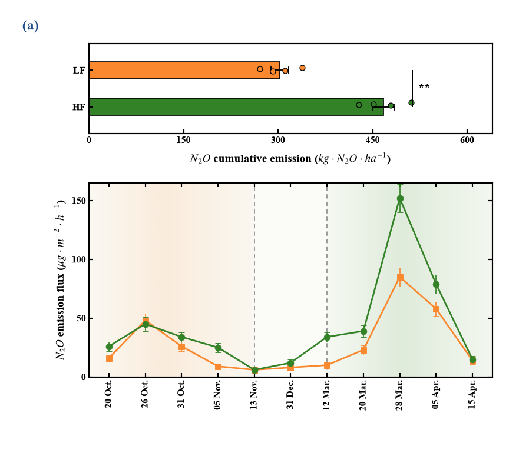 | 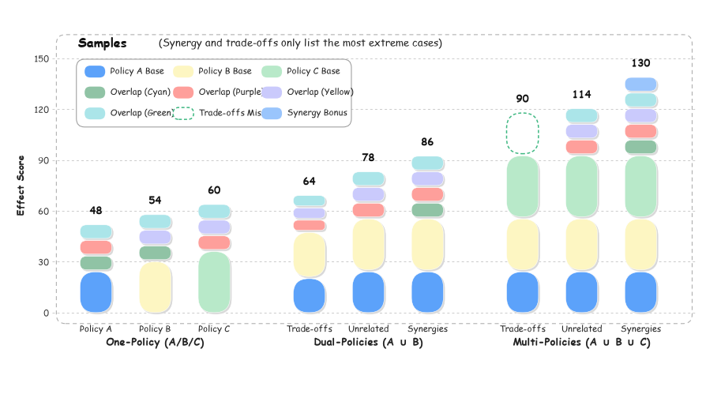 | 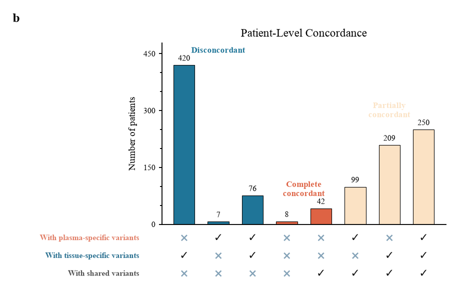 |
| aggregate bars over an ordered series | cartoon stacked capsules | UpSet combination bars |

| `flower-plot` | `grouped-gradient-hist` | `grouped-lm-marginal` |
|:---:|:---:|:---:|
| 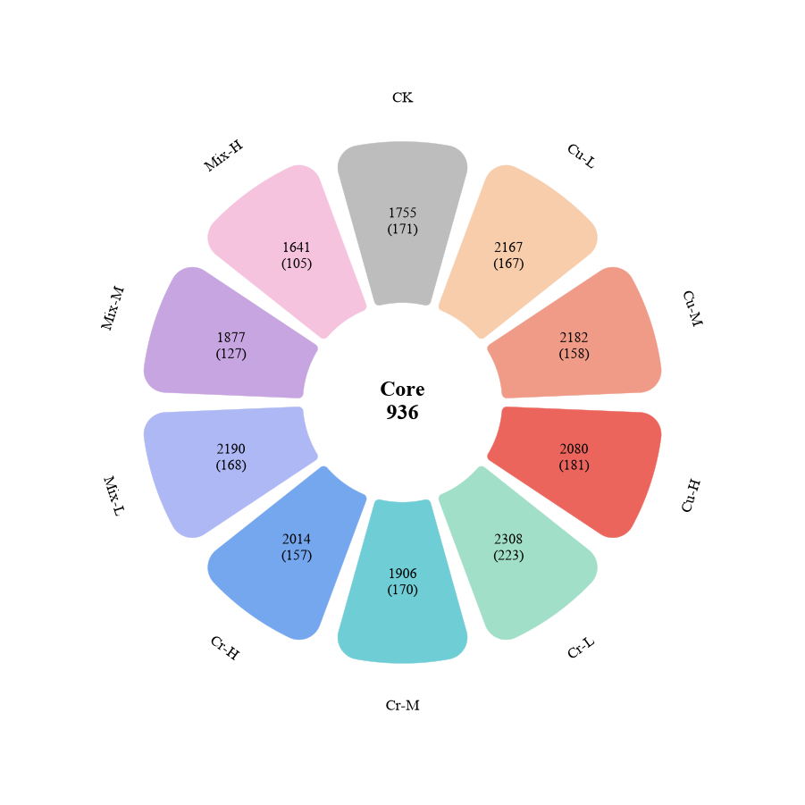 | 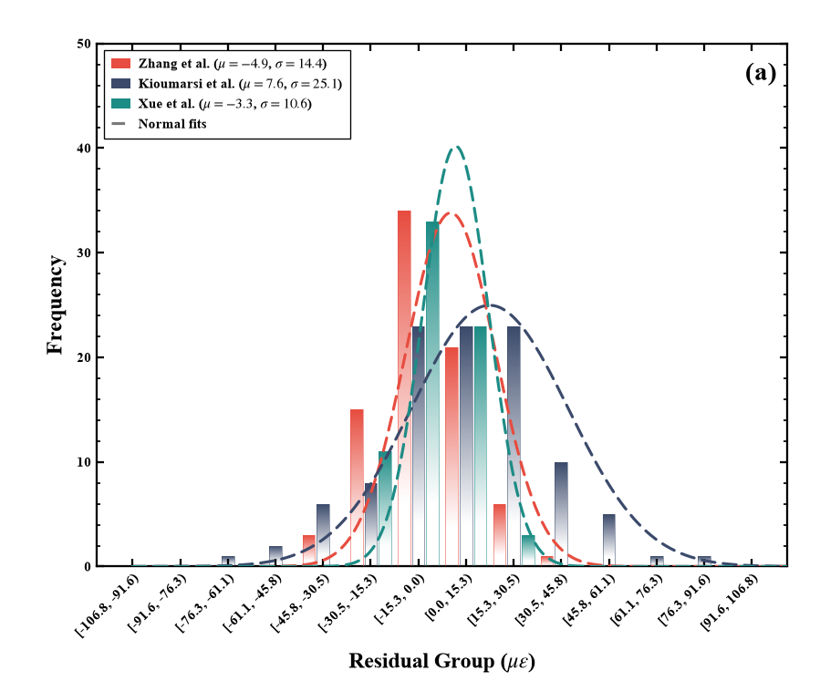 | 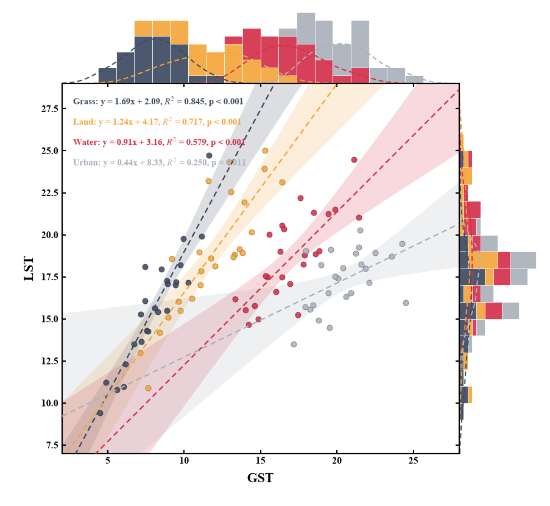 |
| per-group and shared counts | gradient histogram with fits | scatter with fits and marginals |

| `grouped-ring-bar` | `pie-3d` | `pie-ring` |
|:---:|:---:|:---:|
| 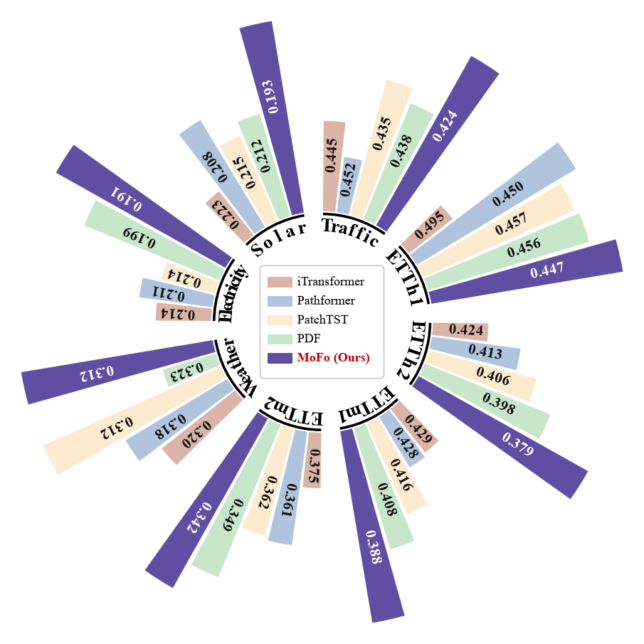 | 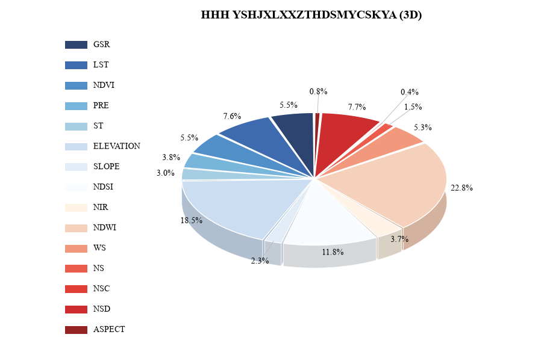 | 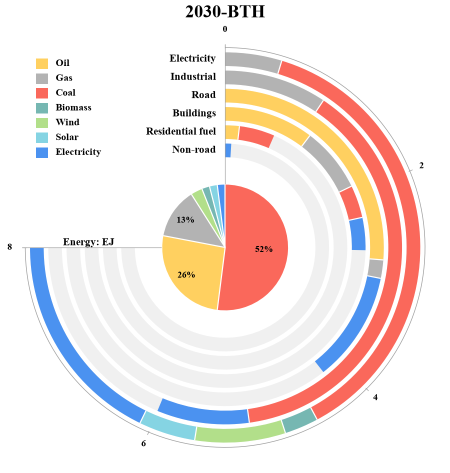 |
| grouped annular bars | pseudo-3D contribution pie | centre pie with stacked rings |

| `radar-bubble` | `radial-line` | `smooth-radar` |
|:---:|:---:|:---:|
| 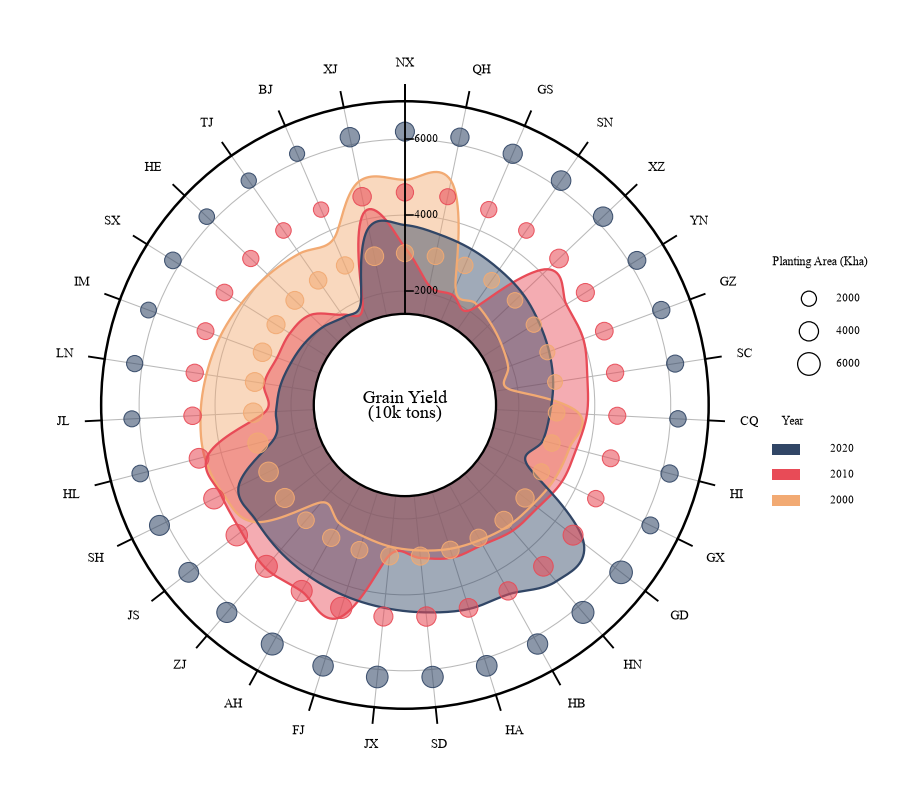 | 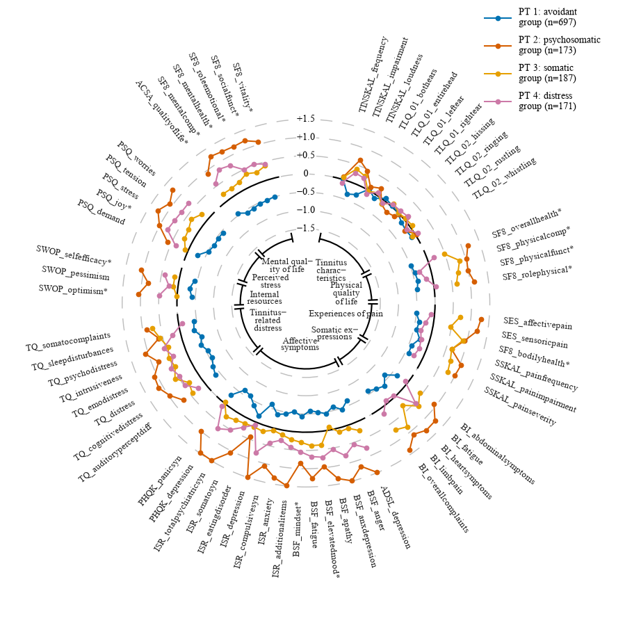 | 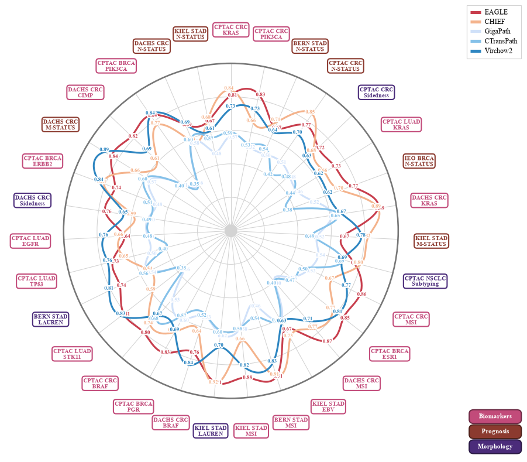 |
| annular radar with bubbles | radial profile over many features | smooth radar over bounded scores |

Each ships 16-18 curated palettes, selectable by number or name. Regenerate this
gallery with `python docs/build_gallery.py`.

## Adding a template

Templates are found by importing every module in `rvl/templates/`, so a new one is
picked up by the catalogue, the recommender, the code generator and the test suite
with no other edits. Drop in a module exposing `SPEC`, `PALETTES`, a data class
with one `from_*` builder, `DEFAULT_DATA`, `ChartStyle`, `DEFAULT_STYLE`,
`create_figure` and a two-line `main`.

Start from [references/adding-templates.md](references/adding-templates.md) and
[references/template-contract.md](references/template-contract.md); copy
`rvl/templates/grouped_ring_bar.py`, which is the reference implementation.

## Layout

| Path | Responsibility |
|------|----------------|
| `SKILL.md` | The skill definition: workflow, fidelity rules, selection guidance |
| `references/` | Detail the agent loads only when it needs it |
| `rvl/ingest.py` | Read files into a `Table` that remembers each value's source cell |
| `rvl/profiling.py` | Summarise a table and enumerate how it can be read |
| `rvl/registry.py` | Discover templates by importing `rvl/templates/` |
| `rvl/recommend.py` | Score templates against a profile, using `SPEC` metadata only |
| `rvl/adapters.py` | Map a reading onto a template's builder arguments |
| `rvl/codegen.py` | Render those arguments as a standalone script |
| `rvl/verify.py` | Check a script against its source, then run it |
| `rvl/templates/` | The chart templates, one module each |
| `examples/` | One dataset per data kind, for trying the pipeline without user data |
| `tests/` | Contract suite plus pipeline tests |

## Programmatic use

```python
from rvl.codegen import generate
from rvl.ingest import read_table
from rvl.profiling import profile_table
from rvl.recommend import recommend

profile = profile_table(read_table("results.xlsx", name="MSE"))
best = recommend(profile).best
print(best.spec.template_id, best.reasons)
generate(best).write("figure.py")
```

Or drive a template directly:

```python
from rvl.templates.grouped_ring_bar import GroupedRingBarData, PALETTES, create_figure

data = GroupedRingBarData.from_matrix(
    categories=("Traffic", "ETTh1", "Weather"),
    series=("Baseline", "Ours"),
    values=((0.445, 0.424), (0.495, 0.447), (0.320, 0.312)),
    value_label="MSE",
    lower_is_better=True,
)
create_figure(palette=PALETTES[0], data=data).savefig("ring.svg")
```

## Tests

```bash
export MPLCONFIGDIR="$PWD/.mplcache"
python -m unittest discover -s tests -t . -q
```

`tests/test_contract.py` runs against every discovered template. Besides the
reference figure, it renders synthetic data at both ends of each template's
supported range, at long label lengths, and at one-thousandth scale — which is what
proves a template is genuinely data-driven rather than pinned to its own reference
figure. Regenerate the example datasets with `python examples/build_examples.py`.

## Provenance

`DEFAULT_DATA` in each template reproduces a published or digitised reference
figure and exists to demonstrate layout. Sources are cited in each module docstring
and in `SPEC.reference`; figures from CC BY papers are attributed to their authors.
